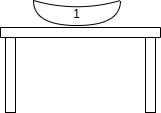

# Stack

The Stack is one of the simplest, and yet most basic data structures in computer science.
This data structure is often used at both software and hardware levels. There are many variations and complications of the Stack. Let's start with the simplest one.

A stack is an ordered collection of data elements, organized according to the LIFO (Last In First Out) principle. 
The most common abstraction for representing the stack is a stack of plates. You can take or put a plate only from the top of the stack. 
If you try to get access to a plate in the middle of the stack then smash all plates.

Let's try to understand this data structure using pictorial images and examples. 
As usual for any data structure, this will be done by parsing the stack methods

## Examples

## Пример.
Let's look at a stack using an example of a stack of plates. At the initial moment of time, the stack will be empty.
Just a table:

1. Adding an element to the stack (one plate).

Usually this operation for the stack named "PUSH"

Доступ к элементам стека может осуществляться только сверху.
    
    вершина стека (забирать и класть элементы можно только с этой стороны)
    | |
    | |
    |-|

После помещения в стек первого шарика он окажется на дне и на вершине стека одновременно.

    
    | |
    |0| <- вершина стека (top)
    |-|
    
Поместим в стек второй шарик, он окажется на вершине стека:

    | |
    |0| <- вершина стека (top), элемент, к которому есть доступ 
    |0| <- прямого доступа к этому элементу мы больше не имеем.
    |-|
    
Теперь мы можем посмотреть и узнать значение только одного элемента стека, лежащего на его вершине. 

При удалении элемента из стека, на вершину стека помещается объект, который был помещён в стек перед удалённым.

    |^|
    |||
    |0| <- убираем этот элемент из стека
    |0| <- прямого доступа к этому элементу мы больше не имеем.
    |-|
    
    | |
    |0| <- этот элемент становится вершиной стека (top)
    |-|
    
## Стандартные функции Стека

### Добаление элемента (Push)
Для добавления элемента в стек используется функция push, которая принимает новый аргумент в качестве параметра.
Принимаемый аргумент помещается на вершину стека.

### Удаление элемента (Pop)  
Для удаления элемента из стека используется функция pop.

### Взятие верхнего элемента (Top)
Для взятия элемента с вершины стека используется функция top.
  
### Взятие размера стека (Size)  
Для взятия количества элементов в стеке используется функция size.

### Проверка на пустоту (Empty)
Для проверки стека на пустоту используется функция empty.
